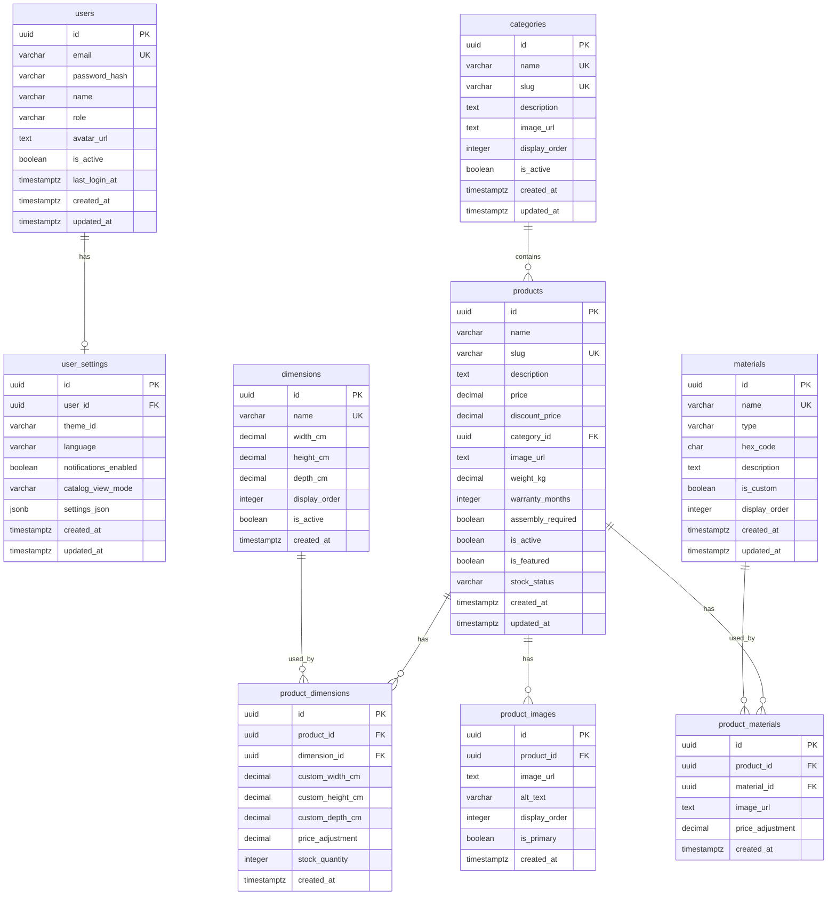
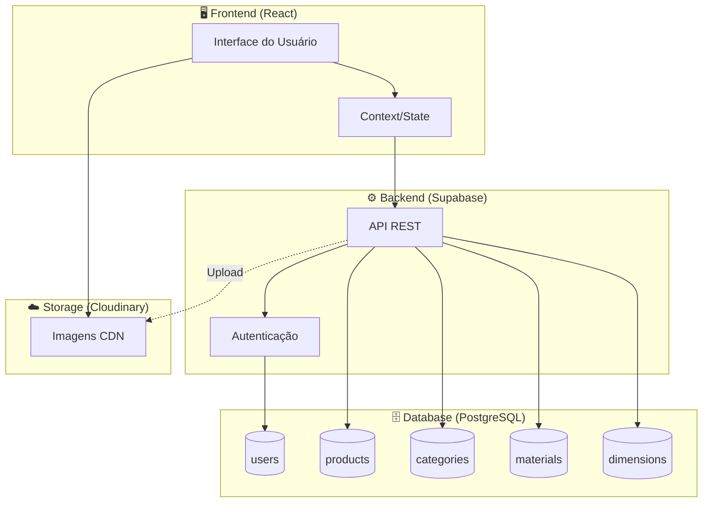

# 📊 Diagrama ER - Miranda Móveis

## Diagrama de Entidade-Relacionamento

## 📋 Legenda

| Símbolo | Significado |
|---------|-------------|
| `PK` | Primary Key |
| `FK` | Foreign Key |
| `UK` | Unique Key |
| `||--o{` | Um para Muitos |
| `||--o|` | Um para Um |

## 🔗 Relacionamentos

### Users
- Um usuário tem **uma** configuração de preferências (1:1)

### Categories ↔ Products
- Uma categoria contém **muitos** produtos (1:N)
- Um produto pertence a **uma** categoria

### Products ↔ Dimensions
- Um produto tem **muitas** dimensões (via junction table)
- Uma dimensão é usada por **muitos** produtos
- Relacionamento N:N através de `product_dimensions`

### Products ↔ Materials
- Um produto tem **muitos** materiais (via junction table)
- Um material é usado por **muitos** produtos
- Relacionamento N:N através de `product_materials`

### Products ↔ Images
- Um produto tem **muitas** imagens na galeria (1:N)

## 📊 Diagrama de Fluxo de Dados

## 🪵 Tipos de Materiais

| Tipo | Descrição | Exemplos |
|------|-----------|----------|
| `wood` | Madeiras e derivados | Madeira Maciça, MDF, Compensado |
| `fabric` | Tecidos e couros | Linho, Veludo, Couro, Suede |
| `metal` | Metais e ligas | Dourado, Cromado, Ferro |
| `glass` | Vidros | Temperado, Fumê, Espelhado |

## 📏 Dimensões Padrão

| Nome | Largura | Altura | Profundidade | Uso Típico |
|------|---------|--------|--------------|------------|
| Compacto | 120cm | 75cm | 60cm | Apartamentos pequenos |
| Padrão | 180cm | 85cm | 80cm | Uso geral |
| Grande | 240cm | 90cm | 90cm | Ambientes amplos |
| King | 300cm | 95cm | 100cm | Camas e sofás grandes |

## 🏷️ Categorias de Móveis

| Categoria | Slug | Descrição |
|-----------|------|-----------|
| Sofás | sofas | Sofás, poltronas e estofados |
| Mesas | mesas | Mesas de jantar, centro, laterais |
| Cadeiras | cadeiras | Cadeiras de jantar, escritório |
| Camas | camas | Camas de casal, solteiro, box |
| Estantes | estantes | Estantes, racks, painéis de TV |
| Armários | armarios | Guarda-roupas e closets |
| Cômodas | comodas | Cômodas e criados-mudos |
| Escrivaninhas | escrivaninhas | Mesas de escritório |
| Acessórios | acessorios | Almofadas, mantas, decoração |
